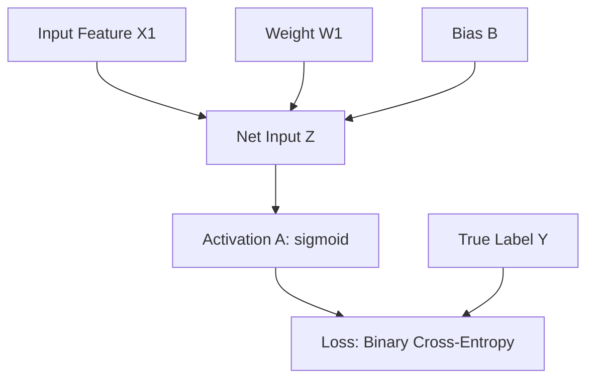
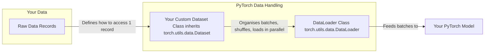
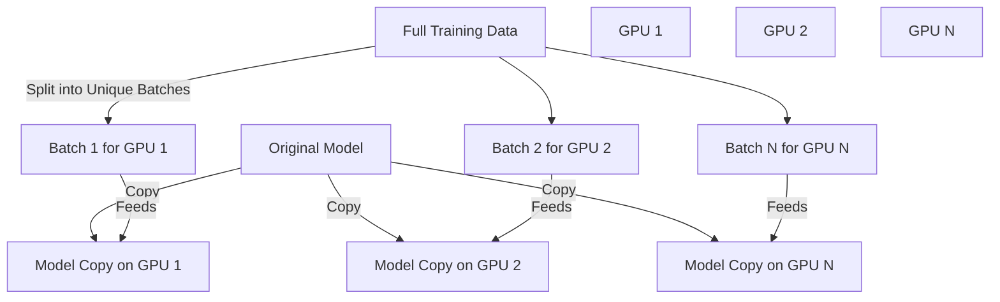
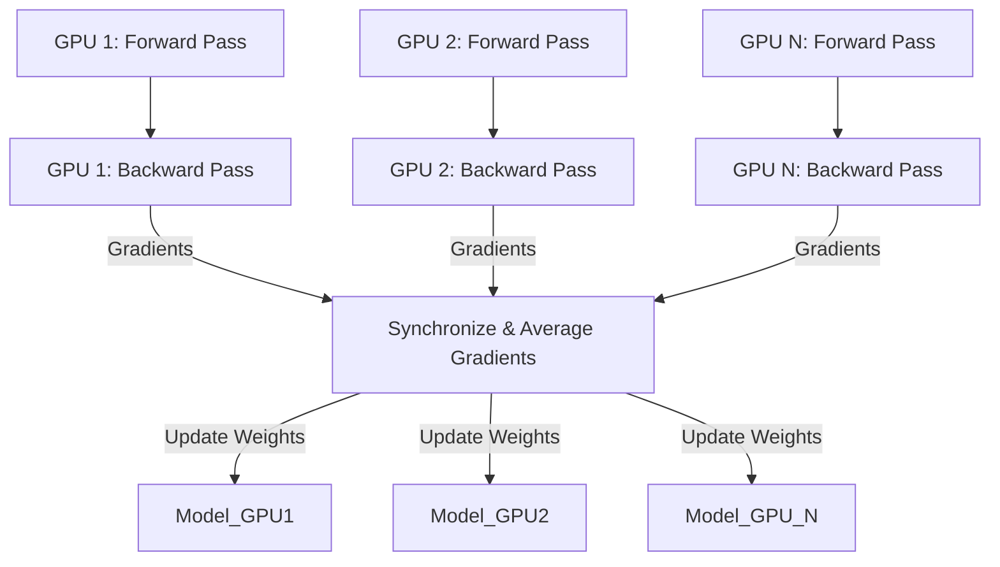

# Pytorch

 We're going to dive into the amazing world of PyTorch, making it super simple and a little bit silly, because who said deep learning can't be fun?

---

## Welcome to the PyTorch Playground: Your AI Super-Toolkit!

Ever wondered how those fancy AI models, like the super-chatty Large Language Models (LLMs), get their brains? Well, they don't just appear out of thin air! Behind the magic often lies a powerful open-source library called **PyTorch**. Think of PyTorch as the ultimate Swiss Army knife for building, training, and deploying deep neural networks – it’s been the top dog for research since 2019 and is quickly winning hearts in the industry too. Why? Because it offers the perfect combo of being **user-friendly and incredibly efficient**, without sacrificing any of that juicy flexibility for advanced users.

In this epic adventure, we're going to unwrap PyTorch's most essential secrets, from its fundamental building blocks to making your models run at warp speed on those glorious GPUs. No more scratching your head, we’re distilling the absolute essentials so you can get building!

---

### PyTorch's Three Superpowers: Meet the Core Components!

Imagine PyTorch as a superhero with three amazing powers that work together to create AI marvels. Let's meet them!

#### Superpower 1: The Tensor Library – Your Data's Super-Container!

At the heart of deep learning, and PyTorch, is something called a **tensor**. If you've ever played with numbers in code, you know about single numbers (scalars), lists of numbers (vectors), and grids of numbers (matrices). Well, a tensor is like the **ultimate generalisation** of all these – it’s a mathematical concept that can handle data in *any* number of dimensions, from zero (a scalar) to many.

**Think of it this way:**
*   A single number? That's a 0-dimensional (0D) tensor. Like your age.
*   A list of numbers (e.g., coordinates `[x, y, z]`)? That's a 1-dimensional (1D) tensor, also known as a **vector**.
*   A spreadsheet (rows and columns)? That's a 2-dimensional (2D) tensor, or a **matrix**.
*   Images? Videos? Text? These are usually 3D, 4D, or even higher-dimensional tensors!

From a computer's perspective, tensors are just **clever data containers** that hold this multi-dimensional information efficiently. And here’s the kicker: PyTorch tensors are like super-charged versions of NumPy arrays (another popular Python library) but with two extra superpowers: an **automatic differentiation engine** (more on that in a bit!) and the ability to **speed up computations on GPUs**. Yes, you heard that right, seamless switching between your computer's brain (CPU) and its graphics card (GPU)!

**Let's get our hands dirty and create some tensors!**

You create these magical containers using the `torch.tensor` function.

```python
import torch

# A scalar (0D tensor) - just a number!
tensor_0d = torch.tensor(1)
print(f"0D Tensor: {tensor_0d}, Dimensions: {tensor_0d.shape}")

# A vector (1D tensor) - a list of numbers
tensor_1d = torch.tensor()
print(f"1D Tensor: {tensor_1d}, Dimensions: {tensor_1d.shape}")

# A matrix (2D tensor) - a list of lists
tensor_2d = torch.tensor([,])
print(f"2D Tensor: {tensor_2d}, Dimensions: {tensor_2d.shape}")

# A 3D tensor - a list of lists of lists
tensor_3d = torch.tensor([[,], [,]])
print(f"3D Tensor: {tensor_3d}, Dimensions: {tensor_3d.shape}")
```

**Output:**
```
0D Tensor: 1, Dimensions: torch.Size([])
1D Tensor: tensor(), Dimensions: torch.Size()
2D Tensor: tensor([,]), Dimensions: torch.Size()
3D Tensor: tensor([[,], [,]]), Dimensions: torch.Size()
```

Notice the `.shape` attribute? It's like asking your tensor, "Hey, how many dimensions and how big are you?".

**Tensor Data Types: Precision is Key!**

Tensors also have data types. If you create a tensor from whole numbers (integers), PyTorch usually defaults to `int64` (a 64-bit integer). But for floating-point numbers (numbers with decimals), it wisely chooses `float32` (a 32-bit floating point). Why 32-bit? Because it's a sweet spot: **enough precision for most deep learning tasks, less memory, and incredibly fast on GPUs**!

```python
float_vector = torch.tensor([1.0, 2.0, 3.0])
print(f"Float Tensor Data Type: {float_vector.dtype}")

# Want to change it? Easy peasy!
new_float_vector = tensor_1d.to(torch.float32)
print(f"Changed Tensor Data Type: {new_float_vector.dtype}")
```

**Output:**
```
Float Tensor Data Type: torch.float32
Changed Tensor Data Type: torch.float32
```

**Common Tensor Operations: Your Daily Workout!**

PyTorch gives you a whole gym full of operations for your tensors. Here are a few must-know moves:

*   **Reshaping (`.reshape()` and `.view()`):** Sometimes your data needs a different form. These methods let you rearrange the tensor's dimensions without changing its actual elements. It's like folding a towel into a different shape!
    *   **Pro-Tip:** PyTorch often has multiple ways to do the same thing, sometimes for historical reasons (like `reshape` vs `view` – both do the job!). It's a bit like having two different types of spoons for the same soup!

    ```python
    my_2d_tensor = torch.tensor([,])
    print(f"Original 2D Tensor:\n{my_2d_tensor}")
    print(f"Original Shape: {my_2d_tensor.shape}")

    reshaped_tensor = my_2d_tensor.reshape(3, 2)
    print(f"Reshaped to 3x2 (using .reshape()):\n{reshaped_tensor}")

    viewed_tensor = my_2d_tensor.view(3, 2)
    print(f"Reshaped to 3x2 (using .view()):\n{viewed_tensor}")
    ```

*   **Transposing (`.T`):** Flipping your tensor across its diagonal. Handy for matrix math!

    ```python
    transposed_tensor = my_2d_tensor.T
    print(f"Transposed Tensor:\n{transposed_tensor}")
    print(f"Transposed Shape: {transposed_tensor.shape}")
    ```

*   **Matrix Multiplication (`.matmul()` or `@`):** The bread and butter of neural networks! This is how layers "talk" to each other.
    *   **Fun Fact:** The `@` operator is a more compact way to do matrix multiplication – like a secret handshake for Pythonistas!

    ```python
    result_matmul = my_2d_tensor.matmul(my_2d_tensor.T)
    print(f"Matrix multiplication (using .matmul()):\n{result_matmul}")

    result_at_operator = my_2d_tensor @ my_2d_tensor.T
    print(f"Matrix multiplication (using @ operator):\n{result_at_operator}")
    ```

---

#### Superpower 2: Autograd – Your Automatic Calculus Sidekick!

Now for the truly mind-blowing part: **automatic differentiation**, or **autograd**. This is what saves you from dusting off your old calculus textbooks and trying to remember what a derivative is!

**The "Computation Graph" Concept:**

Imagine every calculation your neural network makes as a tiny little step on a map. PyTorch, in the background, draws this map – a **computation graph**. This graph is essentially a visual representation of all the mathematical operations your model performs to get from its input data to its final output (like a prediction). We need this map for a crucial process called **backpropagation**, which is how neural networks learn.




This graph is a simplified view of a neural network's "forward pass" – where data flows *through* the network to make a prediction. PyTorch builds this exact kind of graph behind the scenes.

**Gradients and the Chain Rule: No More Manual Math!**

To train a neural network, we need to know how much each internal "setting" (called a **parameter**, like `W1` or `B` in our graph) needs to change to reduce the "loss" (how wrong our model's predictions are). This is where **gradients** come in – they tell us the direction and magnitude of change needed. And computing these gradients relies on a calculus concept called the **chain rule**.

**Here's the magic:** PyTorch's autograd engine automatically tracks every operation on your tensors and builds that computation graph. When you tell it to, it then uses the chain rule to figure out all the gradients for you, **automatically**!

You typically mark the tensors you want gradients for by setting `requires_grad=True` when you create them.

```python
import torch
import torch.nn.functional as F
from torch.autograd import grad

y = torch.tensor([1.0]) # True label
x1 = torch.tensor([1.1]) # Input feature
w1 = torch.tensor([2.2], requires_grad=True) # Weight (we want to update this!)
b = torch.tensor([0.0], requires_grad=True) # Bias (we want to update this too!)

z = x1 * w1 + b # Net input calculation
a = torch.sigmoid(z) # Activation & output
loss = F.binary_cross_entropy(a, y) # How 'wrong' our prediction is

# Manual way to get gradients (for demonstration)
grad_L_w1 = grad(loss, w1, retain_graph=True) # retain_graph=True so we can reuse it
grad_L_b = grad(loss, b, retain_graph=True)
print(f"Manual Gradients: dLoss/dw1: {grad_L_w1}, dLoss/db: {grad_L_b}")

# The super practical way: just call .backward() on your loss!
# PyTorch then stores gradients in the .grad attribute of the tensors
loss.backward()
print(f"Automatic Gradients: w1.grad: {w1.grad}, b.grad: {b.grad}")
```

**Output:**
```
Manual Gradients: dLoss/dw1: (tensor([-0.0898]),), dLoss/db: (tensor([-0.0817]),)
Automatic Gradients: w1.grad: tensor([-0.0898]), b.grad: tensor([-0.0817])
```

See? Same numbers! The main takeaway here is that **PyTorch handles all the hairy calculus for you via the `.backward()` method**. No more sweating over calculus textbooks!

**💥 Important Missing Piece Alert: The Gradient Reset Button (`optimizer.zero_grad()`) 💥**

This is a **CRUCIAL** point that can trip up many beginners! After PyTorch calculates the gradients (using `.backward()`), it keeps them around. If you run another training step without clearing them, the new gradients will **accumulate** (add up) to the old ones. This is usually *not* what you want!

Think of it like this: if you're trying to figure out which direction to walk, you want to base your decision on *this step's* slippery ground, not a combination of all the slippery grounds you've ever encountered!

That's why you **MUST** call `optimizer.zero_grad()` at the beginning of each training iteration to reset the gradients to zero before computing new ones. PyTorch leaves this manual step to you because, in some advanced scenarios (like gradient accumulation for very large models), you *do* want to intentionally accumulate gradients.

---

#### Superpower 3: Deep Learning Utilities – Building Blocks for Your AI Brains!

PyTorch isn't just about cool tensors and calculus automation; it's also a full-fledged **deep learning library**. This means it provides all the essential "Lego bricks" you need to build a wide variety of deep learning models, including pre-trained models, different ways to calculate loss, and optimizers (the algorithms that use gradients to update your model).

**Building Neural Networks with `torch.nn.Module`**

When you want to construct your AI's brain (a neural network), you typically define its architecture by **subclassing `torch.nn.Module`**. This class provides a fantastic framework for building and training models, keeping track of all those important trainable parameters.

Your custom network will usually have two main parts:
1.  **`__init__` (The Blueprint):** Here, you define all the layers and components that make up your network.
2.  **`forward` (The Data Flow):** This method describes how your input data flows through those layers to produce an output – it's where the computation graph comes alive!
    *   **Fun Fact:** You rarely, if ever, need to implement a `backward` method yourself. PyTorch's autograd handles that magic automatically!

Let's build a classic: a **Multilayer Perceptron (MLP)**, which is just a fancy name for a neural network with multiple "hidden" layers.

```python
import torch
import torch.nn as nn # Neural network building blocks

class NeuralNetwork(nn.Module):
    def __init__(self, num_inputs, num_outputs):
        super().__init__() # Always call this first!
        self.layers = nn.Sequential(
            # First hidden layer: Takes 'num_inputs' features, outputs 30
            nn.Linear(num_inputs, 30),
            nn.ReLU(), # A non-linear 'activation' function (Rectified Linear Unit)

            # Second hidden layer: Takes 30 features, outputs 20
            nn.Linear(30, 20),
            nn.ReLU(), # Another activation

            # Output layer: Takes 20 features, outputs 'num_outputs' (e.g., number of classes)
            nn.Linear(20, num_outputs),
        )

    def forward(self, x):
        logits = self.layers(x)
        return logits

# Instantiate our brilliant AI brain!
model = NeuralNetwork(num_inputs=50, num_outputs=3)
print("Our Neural Network's Architecture:")
print(model)
```

**Output:**
```
Our Neural Network's Architecture:
NeuralNetwork(
  (layers): Sequential(
    (0): Linear(in_features=50, out_features=30, bias=True)
    (1): ReLU()
    (2): Linear(in_features=30, out_features=20, bias=True)
    (3): ReLU()
    (4): Linear(in_features=20, out_features=3, bias=True)
  )
)
```

We used `nn.Sequential` here, which is like a neat conveyor belt for layers – data just flows from one to the next in order. It makes your `forward` method super clean!

**Trainable Parameters: The Knobs and Dials of Your AI**

Neural networks learn by adjusting their internal settings, known as **trainable parameters** (mainly weights and biases within `nn.Linear` layers). PyTorch makes it easy to count them:

```python
num_params = sum(p.numel() for p in model.parameters() if p.requires_grad)
print(f"Total number of trainable model parameters: {num_params}")
```

**Output:**
```
Total number of trainable model parameters: 2213
```

Each parameter with `requires_grad=True` (which is the default for `nn.Linear` layers) will be updated during training. These parameters start off as **small random numbers** to help the network learn diverse patterns. If you want your random numbers to be the *same* every time you run your code (useful for debugging and reproducible research!), you can **seed PyTorch's random number generator**:

```python
torch.manual_seed(123) # Pick any number you like!
model = NeuralNetwork(num_inputs=50, num_outputs=3) # Re-instantiate for new random weights
print(f"First Layer Weights (a peek!):\n{model.layers.weight.shape}")
```

**Output:**
```
First Layer Weights (a peek!):
torch.Size()
```

**The `forward` Pass in Action (and why `no_grad` is your friend!)**

Let's feed some dummy data through our model:

```python
torch.manual_seed(123)
X_dummy_input = torch.rand((1, 50)) # A single random input example with 50 features
output_logits = model(X_dummy_input) # This automatically calls the 'forward' method!
print(f"Model Output (Logits): {output_logits}")
```

**Output:**
```
Model Output (Logits): tensor([[-0.1262, 0.1080, -0.1792]], grad_fn=<AddmmBackward0>)
```

Notice `grad_fn=<AddmmBackward0>`? That's PyTorch telling you, "Hey, I just did a matrix multiplication and addition (`Addmm`) to get this, and I'm ready to compute gradients if you ask!"

**But what if you're just using the model for predictions, not training?**
Constructing that computation graph costs memory and computation! This is where `**torch.no_grad()**` rides in like a superhero to save the day! Wrap your inference code in it, and PyTorch will know it doesn't need to track gradients, saving you resources.

```python
print("\nModel Output (Logits) without gradient tracking (for inference):")
with torch.no_grad():
    output_inference = model(X_dummy_input)
    print(f"Model Output: {output_inference}")
```

**Output:**
```
Model Output (Logits) without gradient tracking (for inference):
Model Output: tensor([[-0.1262, 0.1080, -0.1792]])
```
See? No `grad_fn` now! It’s like putting the pencil down after you’re done drawing the graph.

**From Logits to Probabilities and Predictions:**

The numbers your model outputs directly are called **logits**. For classification tasks, these usually need to be converted into **probabilities** (numbers between 0 and 1 that sum to 1) using a `softmax` function. However, PyTorch's common loss functions (like `cross_entropy`) often apply `softmax` internally for numerical stability, so you usually pass the logits directly to the loss function during training.

For showing probabilities to humans, you can manually apply `softmax`:

```python
with torch.no_grad():
    probabilities = torch.softmax(output_inference, dim=1) # dim=1 ensures it sums probabilities across the output nodes
    print(f"Class Membership Probabilities: {probabilities}")
```

**Output:**
```
Class Membership Probabilities: tensor([[0.3113, 0.3934, 0.2952]])
```
These values are your model's confidence for each of the three output classes.

To get the final predicted **class label**, you simply pick the class with the highest probability using `torch.argmax`. You can even apply `argmax` directly to the logits; the result will be the same because `softmax` just scales the numbers, it doesn't change their order!

```python
predictions = torch.argmax(probabilities, dim=1)
print(f"Predicted Class Label: {predictions}")
```

**Output:**
```
Predicted Class Label: tensor() # Our model thinks it's class 1 for this random input!
```

**Feeding Your Model: DataLoaders and Datasets**

Your model needs food (data!) to learn. And just like you wouldn't eat a whole cow in one go, models don't process all data at once. They eat in "batches". PyTorch has two essential tools for this: `Dataset` and `DataLoader`.

*   **`Dataset` (The Chef):** This class knows *how* to load a single data record (one "meal"). You tell it where your ingredients are and how to slice them.
*   **`DataLoader` (The Waiter):** This class takes your prepared meals from the `Dataset` and serves them up in batches, shuffles them (so the model doesn't learn the order), and can even do it in parallel.

**Mermaid Code for Dataset and DataLoader Flow:**


Let's make a tiny `ToyDataset` and `DataLoader` to see how it works:

```python
from torch.utils.data import Dataset, DataLoader

# Our tiny dataset (features and labels)
X_train = torch.tensor([[-1.2, 3.1], [-0.9, 2.9], [-0.5, 2.6], [2.3, -1.1], [2.7, -1.5]])
y_train = torch.tensor()

class ToyDataset(Dataset):
    def __init__(self, X, y):
        self.features = X
        self.labels = y

    def __getitem__(self, index):
        # The waiter (DataLoader) asks for one item by index!
        return self.features[index], self.labels[index]

    def __len__(self):
        # The waiter asks, "How many meals do you have?"
        return self.labels.shape

train_ds = ToyDataset(X_train, y_train)
print(f"Our dataset has {len(train_ds)} examples.") # Use the __len__ method!

# Now, the DataLoader (the waiter!)
torch.manual_seed(123) # For reproducible shuffling!
train_loader = DataLoader(
    dataset=train_ds,
    batch_size=2, # Serve 2 examples at a time
    shuffle=True, # Mix 'em up!
    num_workers=0, # Start with 0 workers for simplicity (more on this soon!)
    drop_last=True # Important! Drop the last batch if it's smaller than batch_size
)

print("\nIterating through batches:")
for idx, (features, labels) in enumerate(train_loader):
    print(f"Batch {idx + 1}: Features={features}, Labels={labels}")
```

**Output:**
```
Our dataset has 5 examples.

Iterating through batches:
Batch 1: Features=tensor([[-1.2000,  3.1000], [-0.5000,  2.6000]]), Labels=tensor()
Batch 2: Features=tensor([[ 2.3000, -1.1000], [-0.9000,  2.9000]]), Labels=tensor()
```

Notice how `drop_last=True` meant our last batch of 1 example was skipped, ensuring all batches are full.

**The `num_workers` Mystery: Your CPU's Helping Hands!**

This little parameter can make a huge difference!
*   **`num_workers=0` (The Lone Chef):** Data loading happens on your main CPU process. This is fine for tiny datasets, but for larger ones, your GPU might be twiddling its thumbs waiting for the CPU to prepare the next batch. It's a **data loading bottleneck**!
*   **`num_workers > 0` (The Kitchen Crew):** PyTorch launches multiple helper processes to load data in parallel, while your main CPU process and GPU focus on training the model. This is typically much faster and makes better use of your computer's power!

**Mermaid Code for num_workers Impact:**
```mermaid
graph TD
    subgraph num_workers = 0 (Bottleneck!)
        CPU_Load0[CPU: Load Data Batch 1] -- Blocks --> GPU_Train0[GPU: Train Model]
        GPU_Train0 -- Idle while CPU loads --> CPU_Load1[CPU: Load Data Batch 2]
    end

    subgraph num_workers > 0 (Efficient!)
        CPU_Main[CPU: Main Process (Training)]
        CPU_Worker1[Worker 1: Load Data Batch 1]
        CPU_Worker2[Worker 2: Load Data Batch 2]

        CPU_Worker1 -- Feeds --> CPU_Main
        CPU_Worker2 -- Prepares ahead --> CPU_Main
        CPU_Main -- Feeds batches to --> GPU_Train[GPU: Train Model]
    end
```

**Word of caution:** While more workers are usually better, setting `num_workers` too high (especially in interactive environments like Jupyter notebooks) can sometimes cause issues due to overhead or resource sharing problems. A good starting point is `num_workers=4` for many real-world datasets.

---

**The Grand Training Loop: Bringing It All Together!**

You've got your data, your brilliant model, and PyTorch's autograd ready to roll. Now, let's put it all into action with a typical **training loop**! This is where your model actually learns.

```python
import torch.nn.functional as F

# Re-initialize everything for a clean start
torch.manual_seed(123)
model = NeuralNetwork(num_inputs=2, num_outputs=2) # Our toy dataset has 2 features, 2 classes
optimizer = torch.optim.SGD(model.parameters(), lr=0.5) # Stochastic Gradient Descent optimizer
num_epochs = 3 # How many times we'll go through the entire dataset

# --- THE TRAINING LOOP ---
for epoch in range(num_epochs):
    model.train() # Set model to training mode (important for things like dropout/batchnorm)
    for batch_idx, (features, labels) in enumerate(train_loader):
        # 1. Forward pass: Get predictions (logits)
        logits = model(features)

        # 2. Calculate the loss (how wrong our predictions are)
        loss = F.cross_entropy(logits, labels) # PyTorch automatically applies softmax internally here!

        # 3. CRUCIAL! Zero out old gradients
        optimizer.zero_grad()

        # 4. Backward pass: Compute gradients
        loss.backward()

        # 5. Update model parameters using the gradients
        optimizer.step()

    # --- LOGGING (to see progress) ---
    print(f"Epoch: {epoch + 1:03d}/{num_epochs:03d} | Train Loss: {loss:.2f}")

model.eval() # Set model to evaluation mode after training
```

**Output:**
```
Epoch: 001/003 | Train Loss: 0.65
Epoch: 002/003 | Train Loss: 0.13
Epoch: 003/003 | Train Loss: 0.00
```
Wow, the loss dropped to zero! Our model is a quick learner on this tiny dataset!

**What's happening in this loop?**
*   **`model.train()` / `model.eval()`:** These are important switches. `model.train()` enables specific behaviors needed during training (like dropout for regularisation, or batch normalization). `model.eval()` turns these off for consistent predictions during evaluation or inference. Even if your model doesn't have these, it's **best practice** to include them!
*   **Optimizer:** We picked `torch.optim.SGD` (Stochastic Gradient Descent). Its job is to use the computed gradients to tweak your model's weights and biases, trying to make the loss smaller.
*   **Learning Rate (`lr`):** This is a **hyperparameter** (a tunable setting you choose!). It tells the optimizer *how big* a step to take based on the gradients. Too big, and you overshoot; too small, and you'll be training forever!
*   **Epochs:** One epoch means your model has seen the entire training dataset once. We train for multiple epochs to give the model plenty of chances to learn.
*   **Loss Function (`F.cross_entropy`):** This measures how well your model is doing. You want this number to go down during training!
*   **`optimizer.zero_grad()`:** (Reiterating because it’s *that* important!) Clears old gradients.
*   **`loss.backward()`:** The magical autograd call that computes all the gradients for your model's parameters.
*   **`optimizer.step()`:** Uses those gradients to update the model's parameters.

**Evaluating Your Masterpiece: How Well Did It Do?**

After training, you want to know if your model actually learned anything! We can use a simple accuracy function:

```python
def compute_accuracy(model, dataloader):
    model.eval() # Always set to eval mode for consistent predictions!
    correct = 0.0
    total_examples = 0
    for features, labels in dataloader:
        with torch.no_grad(): # No need for gradients during evaluation!
            logits = model(features)
            predictions = torch.argmax(logits, dim=1)
            compare = (labels == predictions)
            correct += torch.sum(compare).item() # .item() gets the Python number from a 0D tensor
            total_examples += len(compare)
    return (correct / total_examples)

print(f"Training Accuracy: {compute_accuracy(model, train_loader):.2f}")
# Assuming you set up a test_loader too (similar to train_loader but shuffle=False)
# print(f"Test Accuracy: {compute_accuracy(model, test_loader):.2f}")
```

**Output:**
```
Training Accuracy: 1.00
```
Our little model got 100% accuracy on the training data! Amazing for a toy example!

**Saving and Loading Models: Preserving Your Genius!**

After all that hard work, you definitely want to save your trained model so you don't have to retrain it every time. PyTorch recommends saving your model's `state_dict` – which is just a fancy Python dictionary containing all its learned parameters (weights and biases).

```python
# Saving
torch.save(model.state_dict(), "my_awesome_model.pth")
print("Model saved to my_awesome_model.pth!")

# Loading
# IMPORTANT: You need to re-create the model architecture first!
loaded_model = NeuralNetwork(num_inputs=2, num_outputs=2) # Needs to match exactly!
loaded_model.load_state_dict(torch.load("my_awesome_model.pth", weights_only=True))
loaded_model.eval() # Put it in eval mode for inference
print("Model loaded successfully!")
```

The `.pth` or `.pt` extension is just a convention; you can name your model file anything you like. When loading, remember that `model.load_state_dict()` expects your `loaded_model` instance to have the **exact same architecture** as the one you saved.

---

### Boosting Performance: GPUs – Your Speed Demons!

Training large deep neural networks, especially things like LLMs, can take ages on a regular CPU. This is where **GPUs (Graphics Processing Units)** come to the rescue! They are like super-powered parallel processing factories, designed to handle thousands of computations simultaneously, making deep learning training **magnitudes faster**.

#### PyTorch Computations on GPU Devices: The Device Dance!

In PyTorch, every tensor and every operation happens on a "device". This device can be your `cpu` or a `cuda` device (NVIDIA GPU).

First, let's see if your computer has a CUDA-compatible GPU ready for action:

```python
print(f"Is CUDA (NVIDIA GPU) available? {torch.cuda.is_available()}")
```

**Output:**
```
Is CUDA (NVIDIA GPU) available? True
```
If it's `True`, you're in business!

To make PyTorch use the GPU, you simply **transfer your tensors (and your model!) to the GPU device** using the `.to()` method.

```python
cpu_tensor_1 = torch.tensor([1., 2., 3.])
cpu_tensor_2 = torch.tensor([4., 5., 6.])
print(f"On CPU: {cpu_tensor_1 + cpu_tensor_2}")

if torch.cuda.is_available():
    gpu_tensor_1 = cpu_tensor_1.to("cuda") # Transfer to GPU!
    gpu_tensor_2 = cpu_tensor_2.to("cuda") # Transfer to GPU!
    print(f"On GPU: {gpu_tensor_1 + gpu_tensor_2}")
else:
    print("No CUDA GPU found, sticking to CPU!")
```

**Output (if GPU available):**
```
On CPU: tensor([5., 7., 9.])
On GPU: tensor([5., 7., 9.], device='cuda:0')
```

Notice `device='cuda:0'`? That means it's living on your first GPU!

**Absolute Golden Rule for GPU Computing:** **ALL tensors involved in an operation MUST be on the SAME device!** If you try to add a CPU tensor to a GPU tensor, PyTorch will throw an error, saying "Expected all tensors to be on the same device!"

**Apple Silicon Users Rejoice!** If you have an Apple Mac with an M-series chip (M1, M2, etc.), PyTorch has experimental support for your `mps` (Metal Performance Shaders) device! Just change `"cuda"` to `"mps"` in your `to()` calls.

#### Single-GPU Training: A Few Simple Tweaks!

Making your training loop run on a single GPU is surprisingly simple – just three lines of code typically need to change!

```python
# Define our device: use GPU if available, otherwise fall back to CPU
device = torch.device("cuda" if torch.cuda.is_available() else "cpu")
print(f"Training on device: {device}")

torch.manual_seed(123)
model = NeuralNetwork(num_inputs=2, num_outputs=2)
model.to(device) # <--- NEW: Transfer the entire model to the device!
optimizer = torch.optim.SGD(model.parameters(), lr=0.5)

num_epochs = 3
for epoch in range(num_epochs):
    model.train()
    for batch_idx, (features, labels) in enumerate(train_loader):
        features = features.to(device) # <--- NEW: Transfer features to the device!
        labels = labels.to(device)   # <--- NEW: Transfer labels to the device!

        logits = model(features)
        loss = F.cross_entropy(logits, labels)

        optimizer.zero_grad()
        loss.backward()
        optimizer.step()

    print(f"Epoch: {epoch + 1:03d}/{num_epochs:03d} | Train Loss: {loss:.2f}")

model.eval()
```
The output will look the same, but if you had a bigger model, it would run much faster!

#### Multi-GPU Training: The Distributed Dance Party (DDP)!

For truly massive models or datasets, even one GPU might not be enough. That's where **distributed training** comes in, dividing the workload across multiple GPUs or even multiple machines!

**PyTorch's `DistributedDataParallel` (DDP)** is your go-to strategy for this.
**How it works:**
1.  **Model Replication:** PyTorch creates a **copy of your model on *each* GPU** you want to use.
2.  **Data Splitting:** Your input data is split into unique "mini-batches," and each GPU gets a different, non-overlapping slice.
3.  **Independent Forward/Backward:** Each model copy on its respective GPU processes its own mini-batch independently, computing its own logits and gradients.
4.  **Gradient Synchronisation (The Dance!):** After each backward pass, the gradients from all the model copies are **averaged and synchronized across all GPUs**. This ensures all model copies stay updated with the same weights.

**Mermaid Code for DDP Model and Data Transfer:**


**Mermaid Code for DDP Forward/Backward/Synchronisation:**


**The big win? Speed!** Theoretically, with two GPUs, you can process an epoch twice as fast, and with eight, eight times faster!

**Important heads-up:** DDP doesn't play nicely with interactive Python environments like Jupyter notebooks. It needs to spawn separate processes, so you'll typically run DDP code as a standalone Python script.

**Key components for DDP:**
*   `DistributedSampler`: Ensures each GPU gets a unique part of the dataset.
*   `DistributedDataParallel (DDP)`: The main class that wraps your model and handles the gradient synchronization.
*   `init_process_group`, `destroy_process_group`: Functions to set up and tear down the distributed communication.

You'll typically run a DDP script using PyTorch's `torchrun` utility. It automatically sets up the environment variables (like `RANK` for the current GPU ID and `WORLD_SIZE` for the total number of GPUs) that your script needs.

```bash
# Example command to run a DDP script (assuming your file is named 'ddp_script.py')
# For 2 GPUs:
torchrun --nproc_per_node=2 ddp_script.py

# For all available GPUs:
torchrun --nproc_per_node=$(nvidia-smi -L | wc -l) ddp_script.py
```
*(Note: The full DDP script is quite long and provided in the source, but these commands show you how to execute it!)*

In a multi-GPU setup, you might see duplicate print statements in your console output. This happens because each GPU process runs independently and prints its own messages. You can control this by checking the `rank` (the ID of the current GPU process) and only printing from rank 0 (the "master" process).

---

### Summary: You're Now a PyTorch Prodigy!

Phew! You've just taken a whirlwind tour through the essentials of PyTorch! Let's recap your newfound superpowers:

*   **Tensors:** Your fundamental, GPU-accelerated data containers.
*   **Autograd:** PyTorch's magical automatic differentiation engine that handles all the calculus for you.
*   **Deep Learning Utilities (`torch.nn.Module`, DataLoaders, Optimizers, Loss Functions):** The building blocks and tools to construct and train sophisticated neural networks.
*   **Training Loop:** The core process of feeding data, calculating loss, backpropagating gradients, and updating your model. Don't forget that `optimizer.zero_grad()`!
*   **GPUs:** Your trusty speed demons for accelerating training, whether it's a single GPU or multiple with DDP.

You're now equipped with the knowledge to start building, training, and optimising your own deep neural networks with PyTorch. So go forth and create some AI magic! Your time is valuable, and now you have the essentials to get building!
